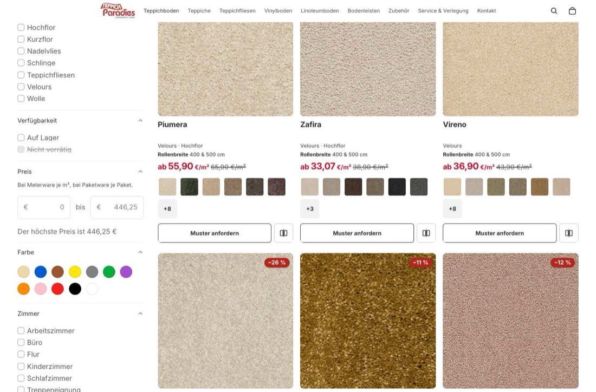
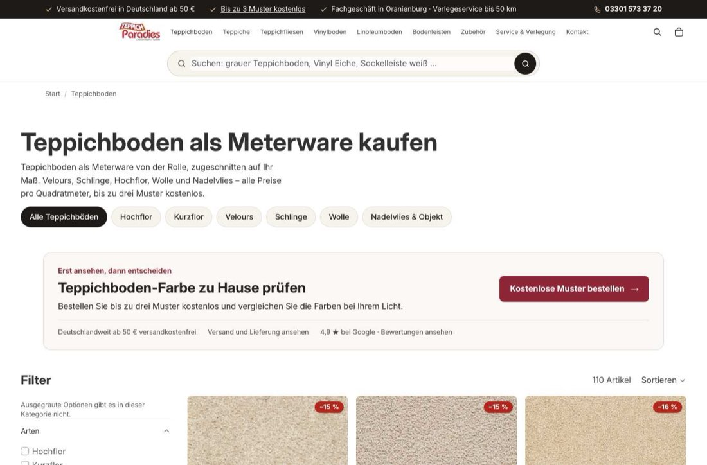
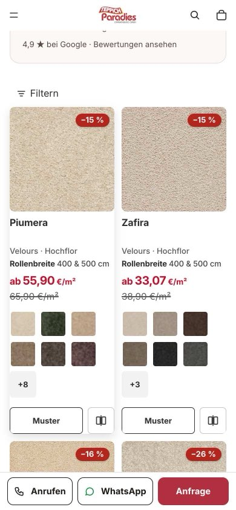
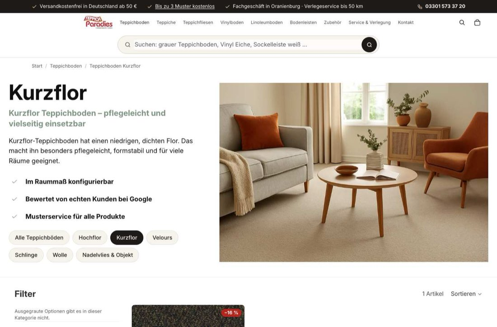
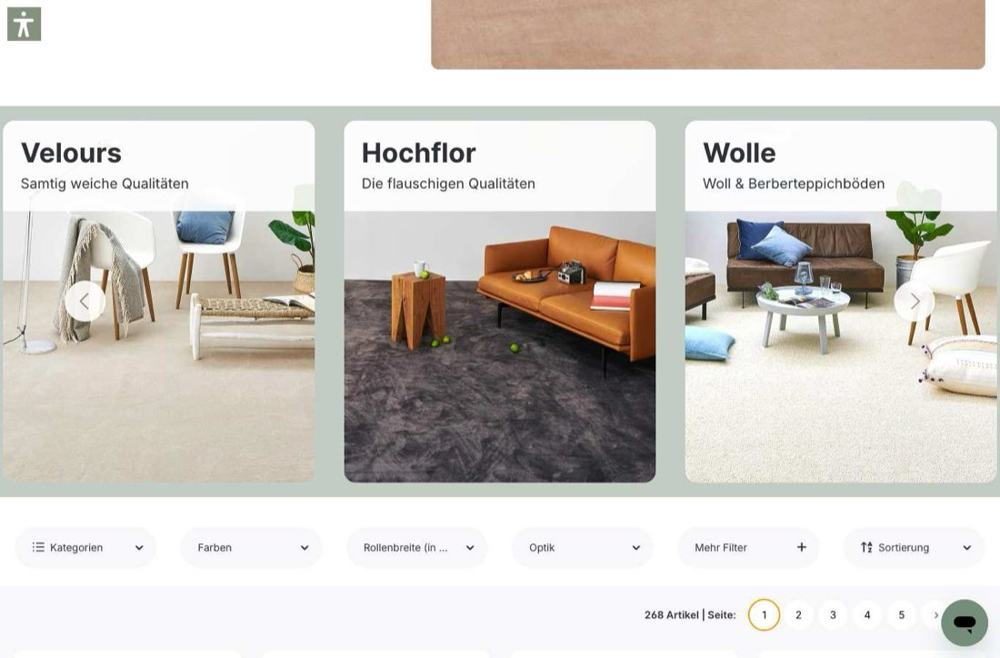
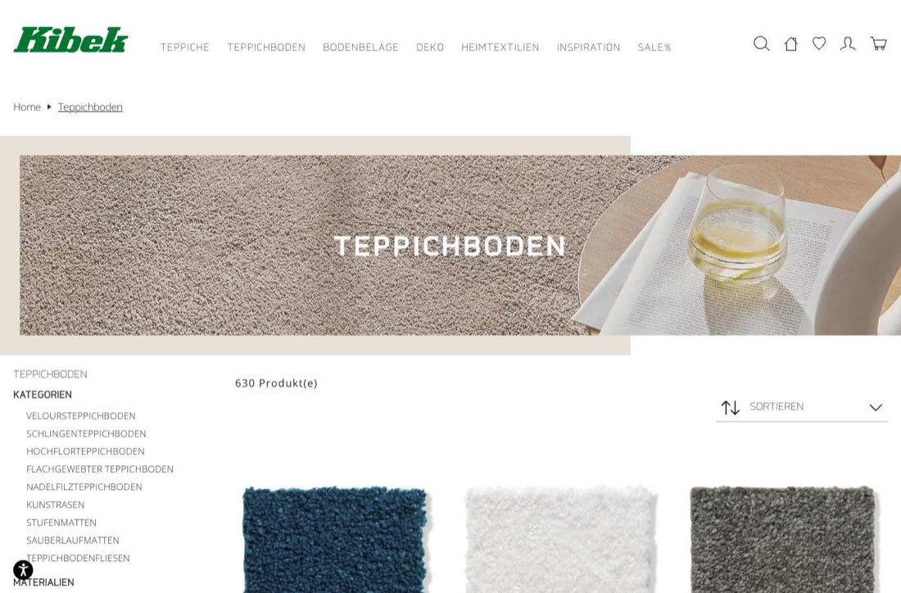
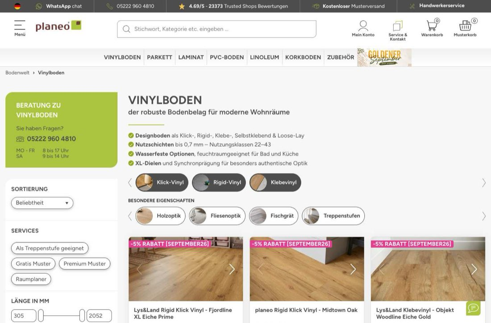

# Shop-Bewertung 2026-09-30: Struktur, Produktdaten, Kundenfreundlichkeit, Wettbewerb

Stand 2026-09-30. Rein lesend: keine Shopify-Daten geändert, keine Preise angefasst, kein Deploy.
Schwerpunkt ist die Zuordnung der Teppichböden. Die Einzeltabelle aller 111 Teppichboden-Produkte steht in
[teppichboden-datenaudit.md](teppichboden-datenaudit.md).

## Kurzfassung

1. **Vier Vinylprodukte stehen mit 4,70 bis 12,05 €/m² im Shop**, alle anderen Vinylböden mit mindestens 16,15 €/m² (Klebevinyl ab 26,31 €/m²). Es sind die vier Altprodukte aus 2025 ohne Produkttyp; ihr Preis wirkt wie ein alter Quadratmeterpreis, der heute als Paketpreis gerechnet wird. Das ist der dringendste Punkt und braucht eine Entscheidung des Inhabers ([Abschnitt 4.1](#41-vier-vinyl-altprodukte-preis-typ-und-tags)).
2. **Die Unterkategorie Kurzflor ist nicht technisch blockiert, sondern schlicht nicht gepflegt.** Das Feld `custom.arten` ist eine Liste, ein Produkt kann in mehreren Unterkategorien liegen, und 19 Rollenwaren tun das schon. Der Wert „Kurzflor“ steht nur an einem Produkt; nach der gepflegten Florhöhe gehören 59 hinein.
3. **Kontura ist laut Lieferantendatenblatt ein Schnittflor (Velours), keine Schlinge.** Der Befund aus der Cloud-Sitzung lässt sich nicht belegen. Richtig ist: Kontura fehlt in Velours.
4. **Fliesen und Planken sind nur zur Hälfte zugeordnet.** 25 von 37 Fliesen/Planken ohne Konstruktionsart haben einen Beleg (11 Schlinge, 14 Velours) und fehlen in den Unterkategorien.
5. **Drei Datenquellen beschreiben die Florhöhe und widersprechen sich**: `custom.arten` (Hochflor ab 10 mm, konsistent), `custom.florhohe_klasse` (nur 50 Produkte, Klassen mit Lücken) und `shopify.pile-type` (17 Produkte als „Hochflor“ bei 5,4 bis 9 mm).
6. **526 von 534 aktiven Produkten tragen einen Streichpreis.** Die Kollektion „Angebote Teppichboden“ ist damit das gesamte Teppichsortiment, und die Kollektion für Rabattcodes enthält nur 8 aktive Produkte.
7. Vorschlag: Konstruktion, Florhöhe und Material in getrennte Felder legen, die Florhöhe als Zahl. Dann entstehen Kurzflor und Hochflor per Kollektionsregel aus dem Messwert, ohne dass jemand Klassen pflegt. Aufwand rund zwei Arbeitstage, vorab in zwei Stunden als reine Datenkorrektur im bestehenden Feld machbar ([Abschnitt 3](#3-zielstruktur-mit-mehrfachzuordnung)).

## 1. Methode und Grenzen

| Quelle | Wofür |
|---|---|
| Shopify Admin API, nur Abfragen (`shopify store execute` ohne `--allow-mutations`, Shopify-MCP) | alle 739 Produkte mit Status, Typ, Tags, Kollektionen, Preisen und 14 Metafeldern; 35 Kollektionen mit Regeln; Menüs; Metafeld-Definitionen |
| Öffentliche Storefront | Filter, Produktkarten, Suche, `npm run menu:guard` |
| Datenblätter von Lieferant A (lokal, nicht im Repository) | Strukturangabe, Polhöhe und Polmaterial je Qualität, zugeordnet über die SKU |
| Headless Chrome (playwright-core, Kanal `chrome`) | Screenshots Desktop 1366 px und Mobil 390 px |

**Belegregel im Datenaudit.** Eine Konstruktion steht nur in der Tabelle, wenn das Lieferantendatenblatt sie nennt (94 Produkte) oder, wo kein Datenblatt zuordenbar war, der eigene Produkttext sie ausdrücklich nennt (5 Produkte, schwächerer Beleg). Bei 12 Produkten gibt es keinen Beleg; sie stehen als offen in der Tabelle. Aus Bildern oder Namen wurde nichts abgeleitet.

**Zuordnung der Strukturangaben.** Loop, Loop Pile, Schlinge/Bouclé und „Schlinge gemustert“ zählen als Schlinge. Velvet, Cut pile, Saxony, Frisé und Kräuselvelours zählen als Velours, weil alle Schnittflor sind; der Shop ordnet die zwei Frisé- und die drei Saxony-Qualitäten schon heute so ein. Wer Frisé oder Saxony als eigene Art führen will, muss das entscheiden.

**Nicht geprüft:** Checkout, Warenkorb, Ladezeiten, Rechtstexte, Preise auf Artikelebene gegen den Einkauf, Conversion-Daten. Die Wettbewerbsseiten wurden je einmal als Kategorieseite geladen, nicht als Kaufpfad (den deckt `wettbewerb/kaufpfad-2026-09-09.md` ab).

## 2. Teppichboden: Befunde zur Zuordnung

### 2.1 Wie die Zuordnung heute funktioniert

- Die sechs Unterkategorien sind automatische Kollektionen mit je einer Regel: `custom.arten` enthält einen bestimmten Wert. Die Zahlen aus der Cloud-Sitzung stimmen: Kurzflor 1, Velours 25, Schlinge 42, Hochflor 9, Wolle 11, Nadelvlies 6, Teppichboden gesamt 111 (110 aktiv, 1 archiviert).
- `custom.arten` ist vom Typ `list.metaobject_reference`. **Ein Produkt kann mehrere Werte tragen und liegt dann in mehreren Unterkategorien.** Das passiert bereits bei 19 Rollenwaren (10 × Schlinge + Wolle, 8 × Velours + Hochflor, 1 × Velours + Wolle + Hochflor) und bei 27 Fliesen und Planken, die neben dem Formatwert „Teppichfliesen“ einen zweiten Wert tragen. Alle neun Hochflor-Produkte liegen zugleich in Velours.
- Das Metaobjekt hinter dem Feld (`teppich_art`) hat 22 Einträge für den ganzen Shop: Konstruktion (Velours, Schlinge, Nadelvlies), Florhöhe (Kurzflor, Hochflor), Material (Wolle), Format (Teppichfliesen), Vinyl-Aufbau (Klick, Klebe, Rolle) und neun Zubehörarten. Der Filter „Arten“ zeigt deshalb auf `/collections/teppichboden` sieben Werte aus vier verschiedenen Fragen in einer Liste.

### 2.2 Abgleich mit den Befunden der Cloud-Sitzung

| Befund der Cloud-Sitzung | Ergebnis der Prüfung |
|---|---|
| Jede Unterkategorie prüft genau einen Wert eines Metafelds, ein Produkt kann daher nur in einer liegen | Erste Hälfte stimmt, die Folgerung nicht. Das Feld ist eine Liste, Mehrfachzuordnung ist im Einsatz. Die Ursache der leeren Kurzflor-Kategorie ist fehlende Pflege. |
| Kontura ist eine Schlinge, steht aber in Kurzflor | Nicht belegbar. Das Datenblatt nennt „Cut pile“ bei 3,4 mm Polhöhe, der Produkttext „kurzer, dichter Flor“. Kontura ist danach ein kurzfloriger Velours: Kurzflor stimmt, Velours fehlt. |
| Velours ist meist kurzflorig, steht aber nicht in Kurzflor | Teilweise. Von 22 Velours-Rollenwaren haben nur 3 bis 5 mm Florhöhe (Kontura, Palura, Velluna); 10 liegen zwischen 5 und 10 mm, 9 ab 10 mm. Kurzflorig sind vor allem die Schlingen (15 von 23 Rollenwaren). |
| Tags tragen Mehrfachwerte wie `stil: hochflor` und `stil: velours` | Nur an einem Produkt, dem Entwurf `aw-ganges-teppichboden`, der in keiner Teppichboden-Kollektion liegt. Kein aktiver Teppichboden hat ein Tag zu Konstruktion oder Florhöhe; die Tags sagen nur `art: teppichboden`, Material, Raum, Nutzungsklasse und Breite. Tags und Metafeld laufen hier also nicht auseinander, weil die Tags das Thema gar nicht abbilden. |
| Kaputt wirkende Vinyl-Tags (`55mm`, `5mm`, `Nutzschicht: 0`, `Gesamthoehe: 2`) | Bestätigt, an genau vier Produkten ([Abschnitt 4.1](#41-vier-vinyl-altprodukte-preis-typ-und-tags)). |

### 2.3 Abweichungen zwischen Ist und Beleg

77 der 111 Produkte haben mindestens eine Abweichung. Zusammengefasst:

| Abweichung | Produkte | davon Rollenware |
|---|---|---|
| Kurzflor fehlt in `custom.arten` (Florhöhe bis 5,0 mm) | 58 | 17 |
| Velours fehlt in `custom.arten` | 15 | 1 (Kontura) |
| Schlinge fehlt in `custom.arten` | 11 | 0 |
| `shopify.pile-type` sagt Hochflor, Florhöhe liegt unter 10 mm | 17 | 11 |
| `shopify.pile-type` sagt Kurzflor bei 6 mm (Altessa) | 1 | 1 |
| Falsch gesetzte Konstruktion (Beleg widerspricht dem Shopwert) | 0 | 0 |

Was gesetzt ist, stimmt also; es fehlen Werte. Würden die belegten Werte im bestehenden Feld ergänzt, ergäbe sich:

| Unterkategorie | heute | mit belegten Werten | davon Rolle / Fliese+Planke |
|---|---|---|---|
| Kurzflor | 1 | 59 | 18 / 41 |
| Velours | 25 | 40 | 22 / 18 |
| Schlinge | 42 | 53 (49 belegt, 4 offen) | 27 / 26 |
| Hochflor | 9 | 9 | 9 / 0 |
| Wolle | 11 | 11 (7 belegt, 4 offen) | 11 / 0 |
| Nadelvlies | 6 | 6 | 1 / 5 |

### 2.4 Florhöhe: drei Felder, drei Antworten

| Feld | gepflegt an | Befund |
|---|---|---|
| `custom.florhohe` (Text, z. B. „3,4 mm“) | 97 von 111 | Stimmt bei 84 Produkten mit der Polhöhe des Lieferanten überein, bei 5 fehlt ein Datenblatt zum Abgleich. Vier Werte sind nicht die Florhöhe, sondern die Gesamtstärke: Ombra 4,5 mm, Vivera 5,1 mm, Tarona 5,3 mm (Webware ohne Polhöhe im Datenblatt) und Fortiva 5 mm (Nadelvlies, der Produkttext nennt den Wert selbst „Stärke“). Bei Callista, Nordica, Rubira und Wovena fehlt der Gegenbeleg. |
| `custom.arten` Hochflor / Kurzflor | 9 / 1 | Hochflor ist sauber: alle neun haben 10 mm oder mehr, keines darunter trägt den Wert. Kurzflor ist ungenutzt. |
| `custom.florhohe_klasse` (Text) | 50 (nur Rollenware) | Klassen „bis 4 mm“, „5 - 8 mm“, „9 - 12 mm“, „über 12 mm“ lassen 4 bis 5 mm und 8 bis 9 mm offen. Das Theme liest das Feld nicht, der Filter auch nicht. |
| `shopify.pile-type` (Shopify-Standardtaxonomie) | 89 | Werte Kurzflor 58, Hochflor 19, Samt 12. „Hochflor“ steht an 17 Produkten mit 5,4 bis 9 mm, darunter die drei Sauberlauf-Fliesen. „Samt“ ist eine Oberflächenoptik, keine Höhe. Das Theme liest das Feld nicht; als Standardattribut kann es an Vertriebskanäle weitergegeben werden. |

Der Storefront-Filter „Florhöhe“ filtert auf den Rohtext von `custom.florhohe` mit 40 verschiedenen Werten. Fliesen ohne Wert (14) verschwinden, sobald ein Kunde den Filter benutzt.

**Regelvorschlag für die Tabelle:** Kurzflor bis 5,0 mm, Hochflor ab 10 mm (gelebte Schwelle), dazwischen ohne eigene Kategorie. Die Schwelle 5 mm ist ein Vorschlag, keine Norm. Mit „bis 4 mm“ wären es 15 statt 18 Rollenwaren und insgesamt 48 statt 59 Produkte. Zwischen 5 und 10 mm liegen 15 Rollenwaren, die heute in keiner Florhöhen-Kategorie auftauchen können; ob es „Mittelflor“ geben soll, ist seit dem Audit vom 2026-09-21 offen.

### 2.5 Wolle

- Schurwolle im Flor ist bei 7 Produkten belegt: Boucella, Lanetta, Lanova, Merinda, Regalia, Vellana, Woolara.
- Callista, Nordica, Rubira und Wovena tragen die Art Wolle, haben aber kein Fasermaterial gepflegt, und das Datenblatt nennt keines. Bei Callista, Nordica und Wovena verweisen Produkttext und Datenblatt nur auf eine Kollektion, die Wolle und Sisal zugleich im Namen führt; bei Rubira steht gar nichts. Das Material des einzelnen Produkts bleibt offen.
- Die drei Sisal-Qualitäten (Fibrella, Sisara, Sisola) liegen nur in Schlinge. Eine Naturfaser-Kategorie gibt es nicht; die Suche nach „sisal“ findet sie.
- Die Tags schreiben dasselbe Material zweimal: `material: wolle` (5 Teppichböden) und `material: schurwolle` (2). Im Metaobjekt `fasermaterial` existieren ebenfalls beide Einträge, „Wolle“ und „Schurwolle“.

### 2.6 Offene Fälle, nicht geraten

| Thema | Produkte |
|---|---|
| Konstruktion ohne Beleg (12) | Basalta, Cosvena, Intervana, Lanvira, Levora, Melbara, Optivia, Rapidia (Fliesen ohne Strukturangabe), Callista, Nordica, Rubira, Wovena |
| Konstruktion mit Beleg, aber außerhalb der drei Arten (4) | Brixana, Brixena, Brixona (Sauberlauf, getuftet), Resora (Flachgewebe, 0,7 mm) |
| Cut-Loop-Struktur (1) | Grandia: Velours belegt, Schlingenanteil offen |
| Florhöhe fehlt, Polhöhe auch beim Lieferanten nicht genannt (14 Fliesen) | siehe Tabelle; bei fünf Nadelvlies-Fliesen ist das Feld zu Recht leer |
| Wolle gesetzt ohne Faserbeleg (4) | Callista, Nordica, Rubira, Wovena |

## 3. Zielstruktur mit Mehrfachzuordnung

### 3.1 Zwei Wege

| | A: bestehendes Listenfeld weiterpflegen | B: getrennte Felder je Frage (Empfehlung) |
|---|---|---|
| Datenmodell | `custom.arten` bleibt für alles | `custom.konstruktion` (Liste, Metaobjekt: Velours, Schlinge, Nadelvlies), `custom.florhoehe_mm` (Dezimalzahl), `custom.fasermaterial` (besteht, 108 Werte). `custom.arten` trägt nur noch Format und Produktart. |
| Kurzflor / Hochflor | von Hand als Wert setzen, bei jedem neuen Produkt wieder | Kollektionsregel auf die Zahl: Florhöhe kleiner 5,01 bzw. größer 9,99. Shopify erlaubt bei Dezimal-Metafeldern „größer als“ und „kleiner als“ als Kollektionsbedingung. Niemand pflegt eine Klasse. |
| Filter | ein Filter „Arten“ mit gemischten Werten | drei Filter: Konstruktion, Florhöhe (Bereich), Material |
| Fehlerbild | bleibt: ein vergessener Wert leert eine Kategorie | Florhöhe kann nicht mehr vergessen werden, solange der Messwert da ist |
| Aufwand | rund 2 Stunden | rund 2 Arbeitstage |

Weg A löst das sichtbare Problem sofort und ist als erster Schritt sinnvoll. Weg B verhindert, dass es zurückkommt, und räumt den Filter auf. Beide Schritte sind Shopify-Schreibvorgänge und brauchen die Freigabe des Inhabers.

### 3.2 Schritt 1: Datenkorrektur im bestehenden Feld (Weg A)

84 Ergänzungen an 77 Produkten, alle belegt: 58 × Kurzflor, 15 × Velours, 11 × Schlinge. Nichts wird entfernt. Umsetzung über den Skill `shopify-massendaten` mit Plan und Rollback-Datei, Gegenprüfung über die Kollektionszahlen aus Abschnitt 2.3. Vorher zu entscheiden sind die Kurzflor-Schwelle und die Frage, ob Fliesen in die Unterkategorien gehören ([Abschnitt 7](#7-entscheidungen-für-den-inhaber)).

### 3.3 Schritt 2: getrennte Felder (Weg B)

| Baustein | Änderung | Aufwand (geschätzt) |
|---|---|---|
| Metafeld-Definitionen | `custom.konstruktion` und `custom.florhoehe_mm` anlegen, beide als Kollektionsbedingung freigeben; `custom.fasermaterial` ebenfalls freigeben | 0,5 h |
| Daten | Konstruktion an 95 Produkten setzen (belegt), Florhöhe als Zahl an 89 Produkten aus dem vorhandenen Text übernehmen; die vier Gesamtstärke-Werte und vier nicht gegenprüfbaren Werte ausnehmen | 3 h mit Plan, Rollback und Gegenprüfung |
| Kollektionsregeln | sechs Unterkollektionen umstellen: Velours, Schlinge, Nadelvlies auf `custom.konstruktion`; Kurzflor und Hochflor auf `custom.florhoehe_mm` plus Produkttyp Teppichboden; Wolle auf `custom.fasermaterial` = Schurwolle. Handles und URLs bleiben. | 0,5 h |
| Menü | keine Pflichtänderung, alle sechs Links bleiben gültig. Optional die sieben Einträge nach Frage gruppieren (Konstruktion, Florhöhe, Material), ohne das Mega-Menü umzubauen. | 0 bis 1 h |
| Filter (Search & Discovery) | auf den Teppich-Kollektionen „Arten“ und den Rohtext-Filter „Florhöhe“ ersetzen durch Konstruktion, Florhöhe als Bereich, Material | 1 h |
| Theme | `snippets/tp-card-roll-widths.liquid` (Kartenzeile „Velours · Hochflor“ liest heute zwei Werte aus `custom.arten`), `snippets/tp-teppich-qualitaet.liquid`, `snippets/tp-filter-sichtbar.liquid` (kennt nur `filter.p.m.custom.arten`), `blocks/tp-produktinfo-tabelle.liquid` | 3 bis 4 h plus QA 2 h |
| Aufräumen | Konstruktions-, Höhen- und Materialwerte aus `custom.arten` entfernen, `custom.florhohe_klasse` stilllegen, `shopify.pile-type` korrigieren oder leeren | 1 bis 2 h |

Vor dem Umstellen an einem einzelnen Produkt prüfen: ob der Bereichsfilter für Dezimal-Metafelder in Search & Discovery so erscheint wie erwartet, und ob die Kollektionsregel „kleiner als 5,01“ Produkte ohne Wert zuverlässig ausschließt.

### 3.4 Die Templates `collection.teppichboden-*.json`

- Die sechs Dateien sind Kopien mit je rund 34 KB. Sie unterscheiden sich in 50 bis 85 Zeilen: Hero-Text, Hero-Bild und welche fünf Geschwister-Kategorien das Karussell am Seitenende zeigt.
- Für beide Wege müssen sie **nicht** geändert werden; sie hängen über das Template-Suffix an der Kollektion, nicht an der Regel.
- Jede neue oder entfallende Unterkategorie (etwa Mittelflor oder Sisal) bedeutet heute sieben Template-Änderungen, weil das Karussell die Geschwister fest verdrahtet. `sections/carousel.liquid` enthält zusätzlich eine CSS-Sonderregel für den Link auf `teppichboden-nadelvlies`.
- Optional, eigener PR: ein gemeinsames Template, das Hero aus Kollektionsbeschreibung und Kollektionsbild liest und das Karussell aus einem Menü. Aufwand etwa ein halber bis ein Tag. Dabei ließe sich auch der Backlog-Punkt „graues Kategoriebild“ erledigen: 32 von 35 Kollektionen haben kein Kollektionsbild.
- Im Hero der Unterkategorien stehen dieselben Punkte wie beim Wettbewerber W1 auf dessen Teppichboden-Seite („Im Raummaß konfigurierbar“, „Musterservice für alle Produkte“), bei gleichem Seitenaufbau aus geteiltem Hero und Kategorie-Karussell. Das sollte eigenständig formuliert werden ([Abschnitt 6](#6-wettbewerb-fünf-deutsche-bodenbelag-shops)).

## 4. Ungereimtheiten im gesamten Shop

Bestand: 739 Produkte, davon 534 aktiv, 151 ungelistet (148 Muster, 2 Service, 1 Test), 27 Entwürfe, 27 archiviert. 35 Kollektionen.

### 4.1 Vier Vinyl-Altprodukte: Preis, Typ und Tags

Betroffen: `sylvara-655-design-klebevinyl-als-einzelplanken`, `sylvara-655-design-klickvinyl-ohne-integrierte-trittschalldammung`, `sylvara-655-design-klickvinyl-mit-integrierter-trittschalldammung`, `eichenhain-design-klebevinyl-als-einzelplanken` (angelegt Juni und August 2025, alle anderen Produkte ab Mai 2026).

| Punkt | Befund |
|---|---|
| Preis | Variantenpreis 21,21 € bzw. 22,91 € bei 1,76 bis 4,87 m² je Paket. Die Storefront zeigt deshalb 6,61 €/m², 4,70 €/m², 11,34 €/m² und 12,05 €/m², jeweils mit −15 %. Zum Vergleich: Klebevinyl sonst 26,31 bis 44,16 €/m², Klickvinyl 16,15 bis 67,11 €/m². Ob der Preis so gewollt ist, kann nur der Inhaber sagen; die Größenordnung spricht für einen Quadratmeterpreis im Paketpreisfeld. |
| Produkttyp | leer. Die Produkte liegen nur in der manuellen Kollektion „Vinylboden“, nicht in Klickvinyl oder Klebevinyl, weil ihnen auch `custom.arten` fehlt. |
| Tags | Dezimalwerte wurden beim Anlegen am Komma getrennt: aus „Nutzschicht: 0,55mm“ wurden `Nutzschicht: 0` und `55mm`, aus „Gesamthöhe: 2,5mm“ wurden `Gesamthöhe: 2` und `5mm`. Zählung: `55mm` 4 ×, `5mm` 3 ×, `Nutzschicht: 0` 4 ×, `Gesamthöhe: 2` 2 ×, `Gesamthöhe: 4` 1 ×, `Gesamthöhe: 6mm` 1 ×. Bei Eichenhain ist das Tag zusätzlich inhaltlich falsch: Das Metafeld nennt 0,3 mm Nutzschicht, das Tag stammt von 0,55. |
| Einordnung | Die Tags sind wirkungslos (das Theme liest sie nicht, die Metafelder sind korrekt), aber sie belegen, dass diese vier Produkte nie auf das heutige Datenmodell umgestellt wurden. Dieselbe Altlast trägt `art: vinyl zum Kleben` / `vinyl zum klicken` statt `klebevinyl` / `klickvinyl`. |

### 4.2 Kollektionen

| Befund | Details |
|---|---|
| Winzige Kollektionen im Menü | Kurzflor 1 Produkt. Nadelvlies & Objekt 6, davon 5 Fliesen. |
| „Alle Teppiche“ zeigt nicht alle Teppiche | `/collections/teppiche` enthält dieselben 50 Produkte wie „Teppich nach Maß“. Die acht Teppiche in Standardgrößen fehlen. Zwei der drei Menüpunkte unter „Teppiche“ führen zum selben Inhalt. |
| „Bodenleisten → Sockelleisten“ ist ein Filterlink ohne Wirkung | Die Kollektion Bodenleisten enthält ausschließlich die neun Sockelleisten; der Filterlink zeigt dasselbe wie „Alle Bodenleisten“. „Kleber & Fixierung“ steht sowohl unter Bodenleisten als auch unter Zubehör. |
| „Teppichboden als Meterware“ ist zu 55 % Paketware | 60 der 110 aktiven Artikel sind Fliesen und Planken mit Paketpreis. Für sie gibt es zusätzlich den eigenen Menüpunkt Teppichfliesen. |
| Drei Sauberlauf-Fliesen mit Produkttyp Teppichboden | Sie liegen in Teppichfliesen und Zubehör, nicht in Teppichboden, erscheinen aber in „Angebote Teppichboden“. |
| Nicht-aktive Produkte in manuellen Kollektionen | 1 archivierte Fliese in Teppichboden (Admin zählt 111, Storefront 110), 8 Klickvinyl-Entwürfe in Vinylboden (293 zu 285), 1 Entwurf in „Teppiche in Standardgrößen“. Für Kunden unsichtbar, aber die Zahlen im Admin stimmen nicht mit dem Shop überein. |
| Angebots-Kollektionen | „Angebote Vinylboden“ (289) und „Angebote Leisten & Zubehör“ (69) haben keine Preisbedingung und enthalten das ganze Sortiment des Typs. „Angebote Teppichboden“ hat die Bedingung, enthält aber trotzdem alle Teppichböden, weil alle einen Streichpreis tragen. Keine der vier Angebots-Kollektionen ist im Menü verlinkt; alle sind öffentlich erreichbar. |
| Interne Kollektion | „Intern: Regulärer Preis (rabattcode-fähig)“ ist auf der Storefront nicht erreichbar (404), das ist richtig so. Sie enthält 211 Produkte, davon nur 8 aktive. Falls Rabattcodes an diese Kollektion gebunden sind, gelten sie praktisch für nichts. |
| Handles mit Zählsuffix | `vinylboden-1`, `linoleumboden-1` |
| Fischgrät | Die Kollektion sucht „Fischgr“ im Titel (24 Treffer), das Tag `muster: fischgrät` tragen nur 16. |

### 4.3 Menü

`npm run menu:guard`: 50 Menülinks geprüft, 0 Fehler. Kein toter Link, kein leeres Raster. Die inhaltlichen Doppelungen aus 4.2 erkennt der Guard nicht, weil die Seiten Produkte zeigen. Im Admin liegt zusätzlich ein nicht verwendetes Menü „Hauptmenü – Entwurf Konzept C“.

### 4.4 Bilder

Kein aktives Produkt ist ohne Bild. 106 aktive Produkte haben genau ein Bild, davon 62 der 63 Vinylböden von der Rolle. 32 von 35 Kollektionen haben kein Kollektionsbild.

### 4.5 Preise und Streichpreise

- 526 von 534 aktiven Produkten haben einen Vergleichspreis; ohne sind nur die 7 Standardteppiche und das Dekofell. Auf den Karten stehen durchgehend Rabattkennzeichen von −11 % bis −26 %.
- Nach `AGENTS.md` dürfen Streichpreise nur bei einer tatsächlich aktiven Produktaktion erscheinen, mit belegtem Vorpreis. Das Metafeld `aktion.start` / `aktion.ende` ist an 20 Produkten gepflegt. Ob die übrigen rund 500 Streichpreise belegte Vorpreise sind, lässt sich aus den Daten nicht erkennen; das sollte der Inhaber klären und rechtlich einordnen lassen, bevor Werbung auf den Shop läuft.
- Drei Teppichböden tragen das Tag `stark-reduziert` und bilden eine eigene Kollektion ohne Menülink.

### 4.6 Preisfilter und Preissortierung

| Kollektion | Was Shopify filtert und sortiert | Folge |
|---|---|---|
| Teppichboden | Rollenware je m² (18,90 bis 251,60 €), Fliesen und Planken je Paket (21,03 bis 446,25 €) | Der Filter trägt den Hinweis „Bei Meterware je m², bei Paketware je Paket“. Trotzdem: „bis 50 €“ blendet 59 von 60 Fliesen und Planken aus, obwohl 10 davon unter 40 €/m² liegen. „Preis aufsteigend“ mischt beide Einheiten. |
| Teppichfliesen | Paketpreis | in sich stimmig, die Karte zeigt aber €/m² |
| Vinylboden | kein Preisfilter | bewusst ausgeblendet, unverändert |
| Teppiche / Teppich nach Maß | kein Filter; Variantenpreise 0,25 bis 2,81 € (Rechenpreis) | Sortierung nach Preis ist ohne Aussage |
| Zubehör, Linoleum, Bodenleisten | Variantenpreis | unauffällig |

Ein Filter auf den sichtbaren €/m²-Preis bräuchte ein eigenes Zahlenfeld je Produkt (Preis je m², beim Preiswechsel mitzupflegen). Bis dahin wäre es konsequent, den Preisfilter auf `/collections/teppichboden` wie bei Vinyl auszublenden oder die Fliesen aus dieser Kollektion zu nehmen.

### 4.7 Filterwerte

- **Gesamtstärke**: 34 verschiedene Werte in zwei Schreibweisen (`2.80 mm`, `2.90 mm` neben `2,5 mm`, `2,0 mm`), unsortiert. Im Vinyl-Filter stehen „2.80 mm · 2.90 mm · 5 mm · 6 mm · 7 mm · 10 mm · 2,0 mm · 2,5 mm“ in dieser Reihenfolge.
- **Florhöhe**: 40 verschiedene Werte als Rohtext ([Abschnitt 2.4](#24-florhöhe-drei-felder-drei-antworten)).
- **Nutzschicht**: `0,3 mm` neben `0,35 mm`, `0,40 mm`, `0,55 mm`, `0,70 mm`.
- **Zimmer**: enthält „Treppeneignung“ (kein Zimmer) sowie „Arbeitszimmer“ und „Büro“ nebeneinander.
- `/collections/zubehoer` zeigt die Filter Florhöhe und Rollenbreite, weil die Sauberlauf-Produkte sie mitbringen.

### 4.8 Tags

303 verschiedene Tags, davon 288 an aktiven Produkten. Das Theme liest nur neun Muster: `zubehoer`, `ohne-muster`, `supplier-draft`, `nicht-veroeffentlichen`, `service`, `maß: wunschmaß`, `art: teppichboden` sowie die Präfixe `material:` und `hoehe:`. Alles andere ist ohne Funktion im Shop.

| Gruppe | Befund |
|---|---|
| Präfix-Tags | `raum:` 11 Werte, `art:` 20, `material:` 13, `nutzungsklasse:` 9, `breite_boden:` 4, `farbe:` 120, `marke:` 6, `dekor:` 26 |
| Doppelte Bedeutungen | `raum: arbeitszimmer` (147) und `raum: buero` (63), dazu `objekt: büro`; `material: wolle` und `material: schurwolle`; `art: vinylboden` meint nur Rollenware; `optik:` und `Optik:`; `hoehe:`, `staerke:` und `Gesamthöhe:` |
| Umlaute uneinheitlich | `raum: küche`, `muster: fischgrät`, `maß:` neben `raum: buero`, `farbe: gruen`, `hoehe:` |
| `farbe:` | 120 Werte an 264 Produkten, bei Vinyl sind es Dekornamen („eiche hellgrau-beige“), 79 davon kommen genau einmal vor. Teppichböden haben praktisch keine Farb-Tags (2 von 113). |
| Lückenhafte Abdeckung | Teppich nach Maß (50 Produkte) ohne Raum-, Art- und Materialtag; je 14 Teppichböden ohne `raum:` bzw. ohne `material:` |
| Interne Arbeits-Tags | `B2B-Daten-fehlen` und `Supplier-Draft` an 26 archivierten Teppichen, `nicht-veroeffentlichen` und `tp-rug-test` an 16 Test-Entwürfen, dazu zwei Markentags in Großbuchstaben an denselben archivierten Produkten |
| Eigenname als Tag | Jeder der 50 Teppiche nach Maß trägt den Namen seines Bodens als Tag (`piumera`, `zafira`, …): 47 Tags mit je einem Produkt |
| Kaputte Tags | die vier Vinyl-Altprodukte aus 4.1 |

### 4.9 Weitere Auffälligkeiten

- **Titel und Handle laufen auseinander** bei 42 umbenannten Produkten: 38 Vinylböden von der Rolle (Titel „Landora“ und „Terracora“, Handles `livano-…` und `marano-…`) und vier Teppichböden (Amara / `alvano`, Serena / `verano`, Velluna / `velano`, Practiva / `solano`). Die URLs zeigen den alten Namen. Kein Fehler, aber jede Auswertung über Handles führt in die Irre.
- **19 Zubehörprodukte tragen die Hausmarke von Lieferant A im sichtbaren Titel** und als Tag `marke:`. Das steht im Widerspruch zur Regel, dass Bezugsquellen nicht kundensichtbar sind. Falls Markenzubehör bewusst unter der Herstellermarke verkauft wird, sollte die Ausnahme in `AGENTS.md` stehen.
- **Suche**: „wolle“ liefert 81 Treffer (Kollektion Wolle: 11), „kurzflor“ 5, „hochflor“ 7 (Kollektion: 9). Die Suche arbeitet über Texte, nicht über die Zuordnung.
- **Produkttexte**: Corina wird als „Kurzflor-Teppichboden“ beschrieben bei 7 mm Polhöhe, Tessara als Kurzflor bei 4 mm. Der Begriff wird im Text also ohne feste Schwelle benutzt.
- Sechs aktive Produkte haben weniger als 200 Zeichen Beschreibung. SEO-Titel und -Beschreibung sind an allen aktiven Produkten gepflegt.

## 5. Kundenfreundlichkeit

**Was gut funktioniert**

- Preis je m² groß auf jeder Karte, Streichpreis und Rollenbreite daneben, Farbfelder mit Zähler, Muster-Schaltfläche direkt auf der Karte.
- Sichtbare Titel sind kurz („Piumera“), die Art steht als eigene Zeile darunter.
- Unterkategorien als Chips über dem Raster, Breadcrumb, Hinweis „Ausgegraute Optionen gibt es in dieser Kategorie nicht“.
- Mobil: zweispaltiges Raster ohne abgeschnittene Texte, feste Leiste mit Anrufen, WhatsApp und Anfrage.

**Was Kunden stolpern lässt**

| Beobachtung | Wirkung |
|---|---|
| Chip „Kurzflor“ führt auf eine Seite mit einem Artikel | wirkt wie ein leeres Sortiment, obwohl 59 Produkte passen |
| Filter „Arten“ mischt Konstruktion, Florhöhe, Material und Format | „Hochflor“ und „Velours“ schließen sich nicht aus, der Kunde weiß nicht, ob er eines oder beides wählen soll |
| Filter „Florhöhe“ und „Gesamtstärke“ mit Dutzenden Einzelwerten | niemand sucht „3,3 mm“; gebraucht werden Bereiche |
| Überschrift „Teppichboden als Meterware“ über einem Raster mit 55 % Fliesen | Paketpreise und Meterpreise stehen nebeneinander, Preisfilter und Sortierung mischen beides |
| Durchgehend rote Rabattkennzeichen | ein Rabatt auf allem ist kein Signal mehr |
| „Alle Teppiche“ ohne die Standardgrößen | Kunden finden fertige Teppiche nur über den zweiten Unterpunkt |
| Florhöhen-Kategorien fehlen für 5 bis 10 mm | 15 Rollenwaren haben keine Höhen-Einordnung |

## 6. Wettbewerb: fünf deutsche Bodenbelag-Shops

Je eine Kategorieseite, geladen am 2026-09-30 in Desktop- und Mobilbreite. W1 bis W4 mit der Teppichboden-Kategorie, W5 mit Vinylboden als Maßstab für Filter und Karten bei großem Sortiment. Die Screenshots sind Ausschnitte zur Analyse; übernommen werden Mechaniken, keine Texte, Bilder oder Gestaltung.

| | Kategoriestruktur | Filter | Produktkarte | Mobil |
|---|---|---|---|---|
| **W1 teppichscheune.de** | Menü „Teppichboden“ mit fünf getrennten Einstiegen: Arten (Velours, Schlinge, Hochflor, Kurzflor, Wolle, Sisal, Nadelfilz, Teppichfliesen, …), Farben, Wohnbereiche, Rollenbreiten, Naturfaser. Auf der Seite ein Karussell mit Kategoriekarten. | Leiste mit Kategorien, Farben, Rollenbreite, Optik, „Mehr Filter“; 268 Artikel | nicht im Ausschnitt | Kategoriekarten vor den Produkten, Chat- und Barrierefreiheits-Schaltflächen überlagern Inhalt |
| **W2 kibek.de** | Seitenleiste nach Konstruktion: Velours, Schlinge, Hochflor, flachgewebt, Nadelfilz; getrennte Gruppen Materialien und Räume. Eigene Landingpages je Farbe und je Rollenbreite. Keine Kategorie Kurzflor. | Größe, Farbe, Form, Breite, Preis, Material, Länge; 630 Artikel | freigestelltes Musterstück, Name, Unterzeile „Velours-Teppichboden, Petrol 83“, „pro qm 16,99 €“, Farbzähler | zweispaltig, Unterzeile wird abgeschnitten |
| **W3 teppichboden.de** | Unterkategorien nach Hersteller, Material (Sisal, Schurwolle) und Farbe | nur Hersteller und Preis | langer Titel mit Konstruktion, Farbe und Rollenbreite; Farbfelder mit Zähler; „Musterbestellung möglich“; Rabattkennzeichen nur an einem Teil | einspaltig, große Bilder, wenig Artikel je Bildschirm |
| **W4 allfloors.de** | Teppichboden, Messe, Kugelgarn, Nadelvlies, Kunstrasen, dazu nach Hersteller | Hersteller, Nutzungsklasse, Belagstärke, Struktur, Dekor, Rollenbreite, Trittschalldämmung; Sortierung „Preis pro m²“ | Artikelnummer, langer Titel, „24,53 € pro m²“, Lieferzeit. Jede Farbe und jede Breite ist ein eigener Artikel, dieselbe Qualität füllt die ganze erste Seite. | zweispaltig, Cookie-Hinweis verdeckt ein Drittel |
| **W5 planeo.de** (Vinyl) | Chips für den Aufbau (Klick, Rigid, Klebe) und eine zweite Chip-Reihe „Besondere Eigenschaften“ (Holzoptik, Fliesenoptik, Fischgrät, Treppenstufen) | rund 20 Gruppen, Stärke und Nutzschicht als Klassen („bis 2 mm“, „bis 4 mm“), Maße als Schieberegler | Maße, Verlegeoptik, Nutzschicht mit Balken, Nutzungsklasse in Worten („33 Intensiv – z. B. Restaurant“), Eigenschafts-Chips, €/m², Ersparnis, Muster-Schaltflächen | einspaltig, feste Schaltfläche „Filter 1482 Artikel“ |

Weitere Ausschnitte im Ordner `screenshots/`: W1 Kopf und mobil, W2 mobil, W3 und W4 Desktop und mobil, W5 mobil.

**Was sich daraus für TeppichParadies ergibt**

1. **Konstruktion ist überall die erste Gliederung**, Florhöhe und Material kommen als eigene Gruppen dazu (W2) oder als eigener Einstieg (W1). Kein Vergleichsshop mischt sie in einem Filter. Das stützt die getrennten Felder aus Abschnitt 3.
2. **Kurzflor ist kein Pflichtpunkt.** Nur W1 führt ihn, W2 mit 630 Teppichböden nicht. Wenn der Punkt im Menü bleibt, muss er gefüllt sein; sonst ist Streichen die ehrlichere Lösung.
3. **Bereiche statt Einzelwerte** bei Stärke und Nutzschicht (W5). Für Florhöhe und Gesamtstärke direkt übertragbar.
4. **Sortierung nach Preis je m²** (W4) setzt ein einheitliches Preisfeld voraus, siehe 4.6.
5. **Nutzungsklasse in Worten** (W5) hilft Laien mehr als die Zahl. Im Shop stehen die Klassen als Tags und Metafeld bereit.
6. **Einstiege nach Farbe, Raum und Rollenbreite** (W1, W2) gibt es im Shop nur als Filter. Als Links im Menü oder unter den Chips wären sie ohne neue Daten machbar, weil die Filterwerte vorhanden sind.
7. **Eine Qualität, eine Karte** mit Farbfeldern ist der bessere Weg; W4 zeigt, wie unübersichtlich die Alternative wird. Der Shop macht das bei Teppichboden bereits richtig.
8. **Abstand zu W1 halten.** Aufbau und zwei Textpunkte der Unterkategorie-Seiten decken sich mit dessen Teppichboden-Seite. Eigene Formulierungen und ein eigener Seitenaufbau gehören in den Template-Umbau aus 3.4.

## 7. Entscheidungen für den Inhaber

| Nr. | Frage | Warum sie vor der Umsetzung nötig ist |
|---|---|---|
| 1 | Sind 4,70 bis 12,05 €/m² bei den vier Vinyl-Altprodukten gewollt? | Preisänderung nur mit Freigabe; bis dahin verkauft der Shop zu diesen Preisen |
| 2 | Kurzflor bis 4 mm oder bis 5 mm? Soll es Mittelflor geben? | bestimmt, welche Produkte in Kurzflor landen und ob 15 Rollenwaren eine Höhen-Kategorie bekommen |
| 3 | Gehören Fliesen und Planken in die Teppichboden-Unterkategorien und in „Teppichboden als Meterware“? | heute halb drin; entscheidet über 41 von 59 Kurzflor-Treffern und über den Preisfilter |
| 4 | Ist Wolle nur Schurwolle im Flor? Bekommt Sisal eine eigene Kategorie? | vier Produkte ohne Faserbeleg, drei Sisal-Qualitäten ohne Kategorie |
| 5 | Kontura als Velours führen? | Datenblatt sagt Schnittflor |
| 6 | Streichpreise: welche sind belegte Vorpreise einer laufenden Aktion? | 526 von 534 Produkten betroffen |
| 7 | Dürfen Markennamen im Zubehörtitel stehen? | 19 Produkte, Regel in `AGENTS.md` sagt nein |
| 8 | Weg A sofort und Weg B danach, oder gleich Weg B? | Aufwand 2 Stunden gegen 2 Tage |

## 8. Vorgeschlagene Reihenfolge

1. Preis der vier Vinyl-Altprodukte klären (Entscheidung 1), danach Typ, `custom.arten` und Tags dieser vier nachziehen.
2. Entscheidungen 2 bis 5 treffen, dann Datenkorrektur nach Weg A: 84 belegte Ergänzungen, Kurzflor-Seite ist gefüllt.
3. Menü-Doppelungen beheben: „Alle Teppiche“ um die Standardgrößen ergänzen, Filterlink Sockelleisten ersetzen.
4. Filterwerte vereinheitlichen (Gesamtstärke-Schreibweise, „Treppeneignung“ aus Zimmer, Büro und Arbeitszimmer).
5. Weg B: getrennte Felder, Kollektionsregeln, Filter, Theme-Anpassung.
6. Optional: gemeinsames Unterkategorie-Template mit eigenem Text und Kollektionsbildern.
7. Tag-Bereinigung in einem Zug über `shopify-massendaten`, nachdem feststeht, welche Tags das Theme künftig noch liest.
